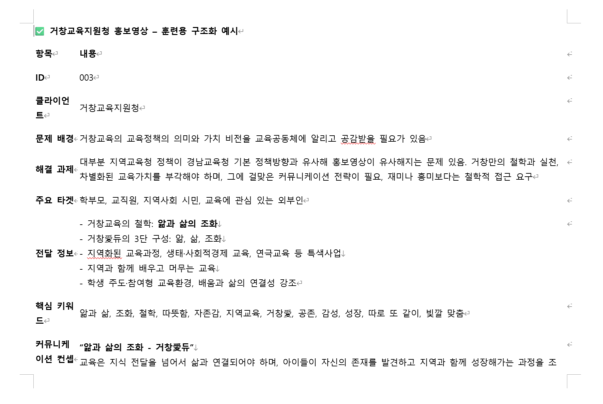

<h1>실 데이터 (엑셀파일) 수집과정 </h1>
4/14일부로 (주)슈퍼히어로로부터 실 데이터 중 테스트 파일을 받음. (워드, 한글, pdf)<br>
이 중 워드 파일 먼저 스크래핑 코드를 통해 데이터 추출 (pdf는 코드 개발 필요, hwp는<br> 파일 특성으로 파일 변환 후 추출 필요.)<br>
<h2>워드 파일 형식 </h2>


위 사진 처럼 워드 파일에 표형식으로 항목 내용별로 구분되어 있음.<br>
=> 문서 내 데이터가 Word의 표 형식으로 들어가 있다면, <br>    <span style="font-weight:bold">일반적인 paragraph 접근이 아닌 표 호출 API를 사용해야 한다.</span><br>
<h2>Word 표 추출 Python 코드</h2>

```python
def extract_docx_table_data(file_path):
    from docx import Document
    doc = Document(file_path)

    data = []

    for table in doc.tables:
        for row in table.rows:
            cells = row.cells
            if len(cells) >= 2:
                key = cells[0].text.strip()
                value = cells[1].text.strip()
                if key and value:
                    data.append((key, value))
    return data
```
코드 전개과정은 다음과 같다.
<h2>코드 전개과정</h2>

```python
from docx import Document
    doc = Document(file_path)
```
docx의 Document패키지를 import하여 docx파일을 불러온다.
```python
for table in doc.tables:
        for row in table.rows:
            cells = row.cells
```
docx파일에 있는 모든 tables 형식을 순회한다. 그 후 각 table에 있는 행들을 cells에 저장한다.
```python
if len(cells) >= 2:
                key = cells[0].text.strip()
                value = cells[1].text.strip()
                if key and value:
                    data.append((key, value))
    return data
```
만약 행의 셀이 2개 이상이라면(데이터 쌍이 2개 이상이라면) ,key와 value를 가져와서 data 리스트에 삽입한 후 리스트를 반환한다.<br>
위 예시 파일에서는 항목, 내용 두개의 셀이 존재한다. 그렇기에 cells[0] (항목), cells[1] (내용)을 받아와서 data리스트에 삽입한다.

<h2>엑셀 저장 과정</h2>

위 코드는 .docx 문서 안의 모든 표를 순회하면서 항목-내용 쌍을 추출한다.<br>
거창교육지원청 워드파일을 입력하면 다음과 같은 구조화된 리스트로 반환된다.<br>

```python
[
  ("ID", "003"),
  ("클라이언트", "거창교육지원청"),
  ("문제 배경", "..."),
  ...
]
```
반환된 데이터 리스트 집합을 엑셀 파일에 저장한다. <br>

```python
def save_structured_docx_to_excel(file_path):
    data = extract_docx_table_data(file_path)
    df = pd.DataFrame(data, columns=["항목", "내용"])
    output_path = Path(file_path).with_suffix(".xlsx")
    df.to_excel(output_path, index=False)
    print(f"[✔] 엑셀 저장 완료: {output_path}")
```
이전 함수에서 반환받은 리스트를 엑셀형식에 맞춰서 저장해야하기에 Pandas의 DataFrame을 사용하여 형식을 맞춘 후 저장한다.


